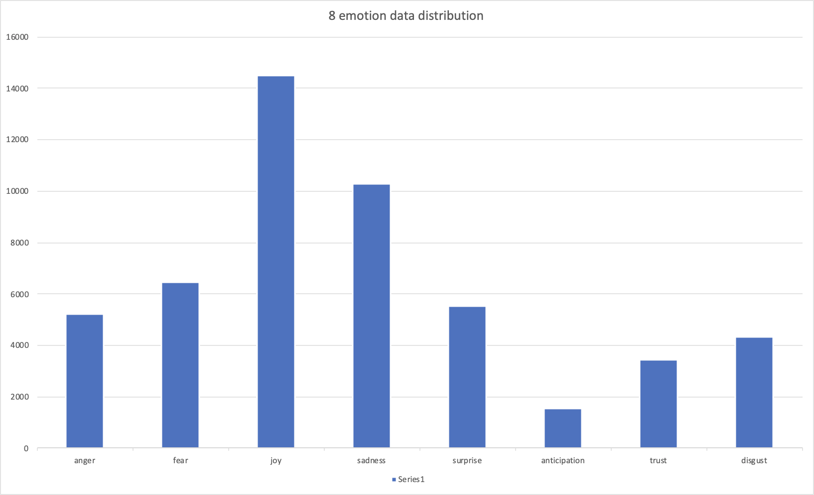
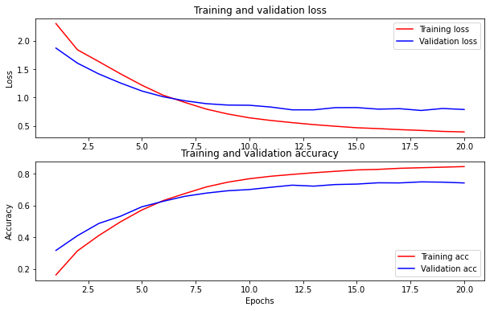
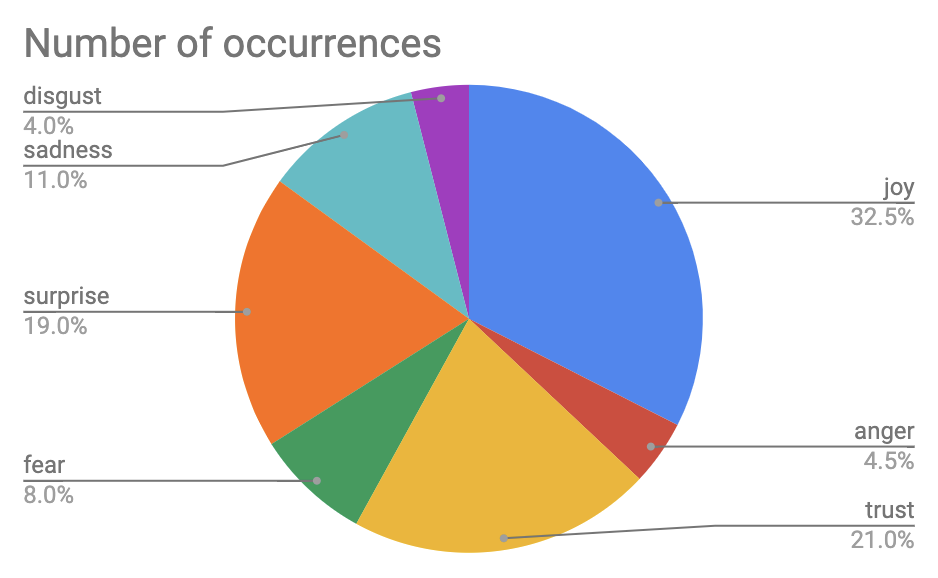

# Instagram_classify_8_emotion
This experiment will have two main steps:

1. Training the neural network on the 8 emotion dataset.
2. Evaluate the trained network on the Instagram reviews.


## Training on the 10 emotion dataset

The dataset `8emtion+cyberaggression` contains 65525 entries of data, which is comprised of 51332 eight emotion data and 14193 aggression data. As we do not need to detect the review is aggresive or not, the data used in the training only contains 51332 eight emotion data.

As shown below, the data is not distributed among 8 emotion categories equally:

| Label        | Count |
| ------------ | ----- |
| anger        | 5219  |
| fear         | 6473  |
| joy          | 14498 |
| sadness      | 10289 |
| surprise     | 5533  |
| anticipation | 1526  |
| trust        | 3449  |
| disgust      | 4345  |
|              |       |
| SUM:         | 51332 |

Showing in the bar chart:




We can see that the "**anticipation**" is the minor set (1526) and "**joy**" is the major set (14498).

During training, we will use over sampling with replacement to balance ten groups first.


### Model

The lowest part of the model is the embedding layer, in which the embedding method we used is Albert. The model is pretrained and provided by the tensorflow-hub. 

Above that are the Dense layer, Dropout layer and Output layer. The structure is relatively simple, but as the connection between embedding layer and dense layer creates big number of parameters, it tooke over 12 hours to train the model on the Tesla P100 GPU(Google Colab).


### Training

The oversampled set is split into two sets: 80% of the data is for training and 20% for validation and test.

During the training, the batch size is set to 32 and learning rate 2e-5. The optimizer algorithm we chose is adam. It took 20 epoches for the model to convergence.



After training, we got the following loss and accuracy on the test set:

```
Loss: 0.787839412689209
Accuracy: 0.7412389516830444
```


## Test on Instagram reviews

The instagram reviews is based on the file `Instagram4_with_label.csv`, which is the test input of the previous experiment.

But this time, we deep cleaned this file again. Including:

- Removing @users
- Removing reviews with only emojis
- Removing reviews with other languages except english

After that, we selected and reserved the longest 200 reviews, which is saved as `Instagram4_with_label_cleaned.csv`.


### Result

After processing the texts in the `Instagram4_with_label.csv` file on our model, we got the labeled texts and saved as `Instagram4_with_label_cleaned_labelled.csv`

After looking through the labelled text, we found the result are not always correct. Here are some examples:

| Label    | Text                                                         |
| -------- | ------------------------------------------------------------ |
| surprise | Wow! This looks so cool got my  fingers crossed one day I'll be riding one! |
| sadness  | Let me know when you’re looking for a representative in  western Canada eh?! |
| disgust  | I respect your initiatives to stop poaching but cmon $25 000  for an ebike? |
| fear     | That's the ugliest ebike yet. Alta got this company beat by a  HUGE margin |
| surprise | Will this version of the bush bike be available to the general  public? 😍 |
| fear     | If they need any help “neutralizing poachers” I’ll book my own  flight. ☠️ |
| joy      | That is bad ass. And I  love the purpose .. help save these animals |


Statistics shows that "Joy" shows the most in the result while the label "anticipation" was not show at all among 200 review labels.




### conclusion and pitfall

In the chart we can see that **Joy** is the majority group, and negative feelings like **disgust, fear** and **anger** are the minority groups. It corresponds with our gut instinct because reviews on Instagram are mostly positive.

Oversampling cannot save the label **anticipation**, which totally disappeared in the result graph. It may also caused by that the final test set is too small (200). We may need a larger test set.

There are still some reviews in other languages than english, which needs a deeper cleaning.

